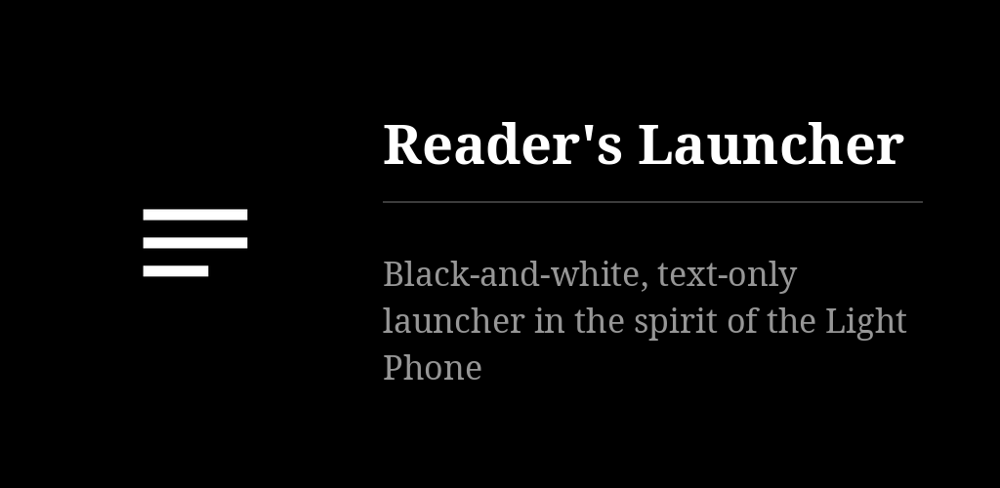
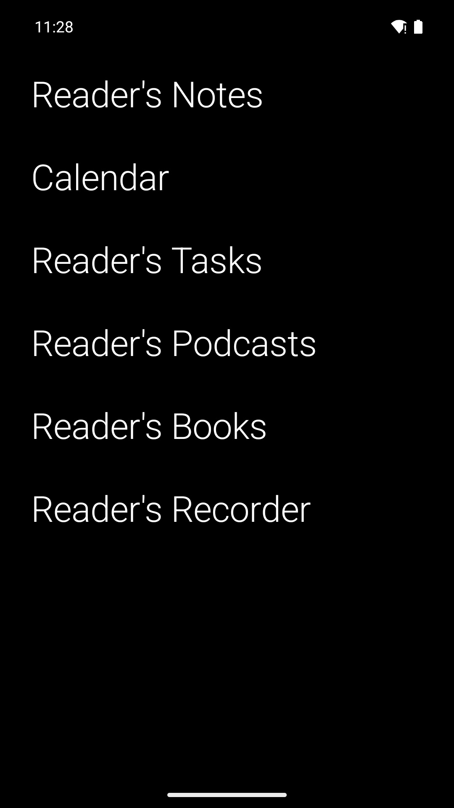
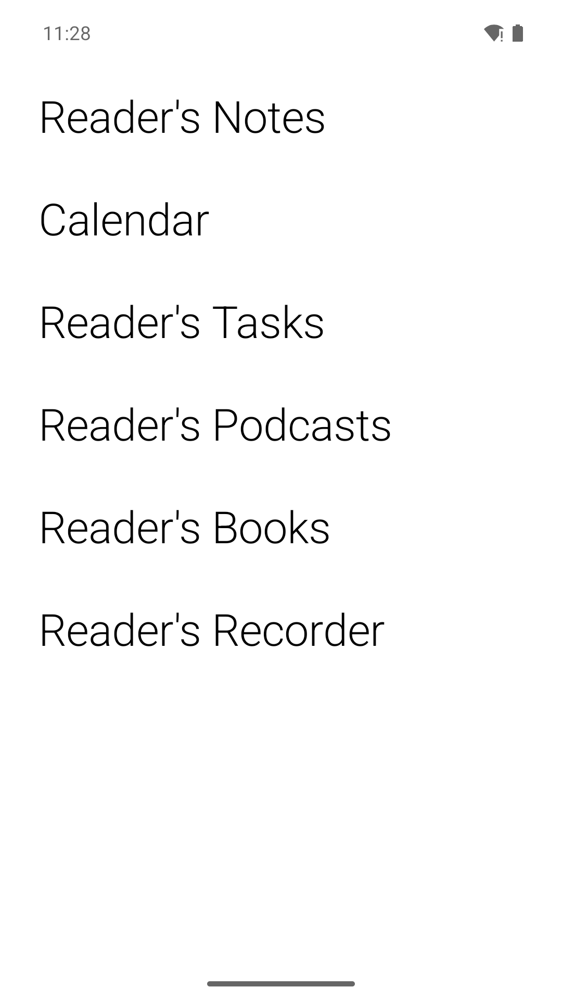

# Reader's Launcher

A black-and-white, text-only Android launcher in the spirit of the Light Phone. The home
screen is one fixed page of words: no icons, no colours, no wallpaper. Text tiles for apps
and categories, built-in tiles for the clock, weather, agenda, tasks and notes, two books a
swipe away. No ads, no tracking. Six languages.

## Key points

* Long press on empty space adds an app, a category or a widget; long press on a tile edits,
  moves or removes it. "Arrange tiles" drags rows into order.
* Swipe up for all apps with search, up and hold for the recently used apps (needs "usage
  access"), down for notifications. Double tap on empty space flips white on black.
* The page never scrolls: it is a fixed grid of cells, and adding is refused once it is full.
  More home pages can be added; a grid of 3 to 5 squares at the bottom holds the key apps.
* Swipe right or left past the pages for the two books: tap the right half to go forward, the
  left half to go back, long press for chapters and text size. EPUB, MOBI (PalmDoc), FB2, text.
* Either side can open a reading app instead (Kindle, Kobo…): settings → left / right of the home
  screen. For Kindle, paste the book's link or ASIN and the swipe opens that book where it was left
  (Kindle's own `kindle://` link, not a documented one; the app alone is opened if it stops working).
* Tiles for the sibling apps: tasks ([Reader's Tasks](https://github.com/funkypitt/readers-tasks-android)
  or Tasks.org), agenda, notes, book, recorder, recordings, mindful, food log, and the Littré
  word of the day. Swipe a tile for the next item; + adds one. Any standard app widget fits too.
* Network is used for the weather only (MeteoSwiss in Switzerland, Open-Meteo elsewhere, no
  key). The launcher never talks to a task or calendar server itself.
* The whole configuration exports and imports as one JSON file, from the settings.
* Android does not let a launcher replace the system's recents view; the "open apps" text list
  is the closest thing available.

More detail: [docs/NOTES.md](docs/NOTES.md).

## Install

From the [F-Droid repo](https://funkypitt.github.io/fdroid-repo/) or the APK attached to a
release.

## Build

```
./gradlew assembleDebug        # app/build/outputs/apk/debug/app-debug.apk
```

Kotlin, Jetpack Compose (foundation only, no Material). minSdk 26, targetSdk 34.

## Licence

MIT. See `LICENSE` for the µLauncher attribution.

## Crédits / Credits

© 2026 Pierre Gallaz. Développé avec [Claude Code](https://claude.com/claude-code) (Anthropic).
Licence MIT, voir `LICENSE`.

© 2026 Pierre Gallaz. Developed with [Claude Code](https://claude.com/claude-code) (Anthropic).
MIT licence, see `LICENSE`.

## Captures d'écran

 
